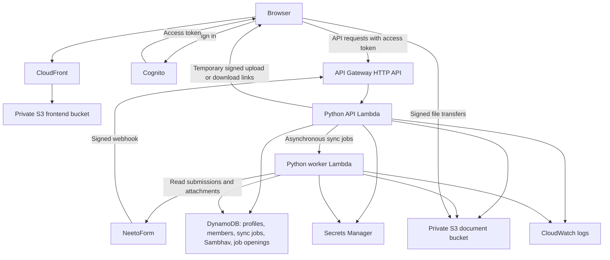

# JSO Community Portal

A private community application for **Idea Incubation**, **Members**, **Sambhav**, and **Jobs**, with shared authentication and administrator-approved access.

**Live application:** [JSO Community Portal](https://dse76eldn9xf5.cloudfront.net)

| Deployment setting | Value |
| --- | --- |
| AWS CLI profile | `jso` |
| AWS account | `223885744552` |
| AWS region | `us-east-1` |
| Terraform workspace | `jso` |
| Terraform configuration | `infrastructure/terraform/jso.tfvars` |

AWS resource names retain the `profile-library` prefix used by the application.

## Features

- **Idea Incubation:** search and filter NeetoForm submissions, read details, preview PDFs, and download private documents. Sync runs in the background.
- **Members:** search active members; combine chapter, country, and region filters; view a country map; and open member details. **Active members** shows the count matching all selected filters and search, before pagination. Clearing filters restores the full count when search is also empty.
- **Member self-editing:** members can update supported personal fields when their verified login email matches the record. Personal edits survive source synchronization.
- **Sambhav:** nine domains with three idea slots each. Approved users can edit domain and idea content, assign members, and upload PDF attachments. Version checks prevent stale saves from overwriting newer edits.
- **Jobs:** paste a job-opening link with an optional title. Open the original website to read the description; approved users can delete a closed listing after confirmation. Listings are shared and persist in DynamoDB.
- **Authentication:** Google or email/password sign-in through Cognito. New accounts require membership in `profile-library-users` before accessing application data.

## Design and architecture



### How requests work

1. **Load and sign in:** CloudFront serves the React application from a private S3 bucket. Cognito authenticates the user and issues tokens.
2. **Read or edit data:** the browser sends an access token to API Gateway. Gateway validates the token; the API Lambda checks application approval and any operation-specific permissions, such as ownership of a member record.
3. **Synchronize data:** the API starts a worker asynchronously and returns a job identifier. The worker imports NeetoForm submissions in batches, saves checkpoints, and stores documents. The browser polls job status. Signed webhooks can also queue submission processing.
4. **Transfer files:** authorized API requests return temporary signed S3 links. File bytes transfer directly between the browser and private storage. Sambhav uploads go to staging and are validated before publication.

### Storage and behavior

| Store | Contents |
| --- | --- |
| `profile-library-prod-profiles` | Idea Incubation metadata and document references |
| `jso-member-details` | Email-keyed member records and personal-edit overrides |
| `profile-library-prod-jobs` | Sync status, checkpoints, and coordination leases |
| `profile-library-prod-sambhav` | Domain/idea content and expiring upload tickets |
| `profile-library-prod-job-openings` | Shared job-opening links, titles, and creation details |
| Private document S3 bucket | Submission PDFs, member photos, and Sambhav PDFs |
| Private frontend S3 bucket | Compiled HTML, JavaScript, CSS, and map geometry |
| Secrets Manager | Integration credentials and Google OAuth configuration |

Directory searches scan the relevant DynamoDB records, then filter, sort, and paginate in the application. This suits the current small directory; search cost grows with the number of records.

Member map counts respect search, chapter, and region. Country selection narrows the list and **Active members** count while keeping the map's country distribution visible. Map geometry is bundled locally; member addresses are not sent to a geocoding service.

Member synchronization removes source-owned records only after a complete source read confirms their absence. Failed or incomplete reads prevent reconciliation. Idea Incubation synchronization retains submissions when they disappear from the source. Member edits remain local overrides and are not written back to NeetoForm.

Sambhav supports PDFs up to 20 MB, with up to 30 attachments per idea. Upload validation checks PDF readability and encryption; it is not malware scanning. Unfinished staged uploads expire after one day.

Infrastructure is managed by Terraform. The application uses Python 3.12 ZIP-packaged Lambdas, without an always-running application server. Private buckets, scoped IAM permissions, restricted CORS, encrypted storage, and temporary file links protect access.

## Approximate monthly AWS cost

**Plan for about USD $2–5 per month for a small community workload, with a $10 monthly planning budget for headroom.** This is a calculated estimate for the resources in this repository in **us-east-1**, using AWS pricing checked on **16 September 2026**. It is not a measured AWS bill or a spending cap; live usage and billing were not queried.

### Usage assumptions

- 200 monthly active users using email/password or Google sign-in.
- 50,000 API calls per month, including 10,000 directory searches/page requests.
- About 200 member records, with modest submission and Sambhav metadata; at most 0.1 GB of DynamoDB data in total.
- Two 512 MB Lambdas: API requests average 0.5 seconds, plus 10,000 worker execution seconds per month for synchronization.
- 5 GB of total S3 storage; 20 GB of direct document/photo downloads and 10 GB of frontend delivery per month.
- 100,000 frontend requests, 100,000 S3 reads, 10,000 S3 writes/list operations, and 1 GB of logs ingested per month with 14-day retention.
- Two secrets: NeetoForm and Google OAuth, with up to 10,000 secret API calls per month.

These are illustrative usage inputs, not current member counts or measured traffic. The estimate assumes the account's applicable recurring free allowances remain available; it does not depend on promotional credits or introductory API Gateway discounts.

| AWS service | Estimated monthly cost | Basis |
| --- | --- | --- |
| Cognito | $0 | 200 direct/social sign-in users are within the 10,000 monthly active user allowance for Essentials. Google social sign-in is included. [Pricing](https://aws.amazon.com/cognito/pricing/) |
| API Gateway HTTP API | $0.05 | 50,000 calls at $1 per million, before introductory discounts. [Pricing](https://aws.amazon.com/api-gateway/pricing/) |
| Lambda API and worker | $0 | About 17,500 GB-seconds plus requests, within the recurring 400,000 GB-second and one-million-request allowances. Before those allowances, compute is about $0.29 plus roughly $0.01 for requests. [Pricing](https://aws.amazon.com/lambda/pricing/) |
| DynamoDB requests, storage, and recovery | $0.30–1.00 | Allowance for scans, reads, and writes across five on-demand tables, plus point-in-time recovery on four tables. Standard rates are $0.125 per million read units, $0.625 per million write units, and about $0.20 per GB-month for recovery. [Pricing](https://aws.amazon.com/dynamodb/pricing/) |
| S3 storage and requests | About $0.21 | 5 GB × $0.023, plus 100,000 GETs × $0.0004/1,000 and 10,000 PUT/LIST operations × $0.005/1,000. Includes both buckets. [Pricing](https://aws.amazon.com/s3/pricing/) |
| Direct S3/API internet transfer | $0 | Assumes combined eligible outbound traffic stays within the shared 100 GB monthly internet-transfer allowance. Document downloads go directly through S3, not CloudFront. [Pricing](https://aws.amazon.com/s3/pricing/) |
| CloudFront frontend delivery | About $0–0.01 | The assumed frontend traffic fits the pay-as-you-go allowance of 1 TB and 10 million HTTP/HTTPS requests; the range allows for small edge-function charges. This estimate does not assume enrollment in a flat-rate plan. [Pricing and allowances](https://aws.amazon.com/cloudfront/faqs/) |
| Secrets Manager | About $0.85 | Two secrets × $0.40, plus 10,000 API calls × $0.05/10,000. [Pricing](https://aws.amazon.com/secrets-manager/pricing/) |
| CloudWatch logs | $0–0.55 | 1 GB of ingestion plus retained logs; depends on remaining shared free allowance. [Pricing](https://aws.amazon.com/cloudwatch/pricing/) |
| **Calculated subtotal** | **About $1.40–2.70** | Rounded service estimates for the assumptions above. |
| **Practical estimate / planning budget** | **$2–5 / $10** | Allows room for variations in sync work, requests, logging, and storage. |

### What increases the bill

- **More searches or larger directories:** filtering happens after a DynamoDB scan. A request returning zero matches still reads the directory. As a conservative example, 10,000 scans consuming 200 strongly consistent read units each use two million read units, or about **$0.25**. Actual units depend on scanned bytes and consistency; pagination and filter changes trigger further scans. [DynamoDB billing](https://aws.amazon.com/dynamodb/pricing/)
- **More files:** each additional 100 GB of S3 Standard storage costs about **$2.30/month**, before request and transfer charges. Retained PDFs, photos, and old frontend assets continue to consume storage. [S3 pricing](https://aws.amazon.com/s3/pricing/)
- **Shared allowances already used elsewhere:** other workloads in the account or billing organization can reduce the free allowance available to this application. Cognito also charges once applicable active-user allowances are exceeded. Recalculate using the linked service prices rather than treating the small-workload estimate as a fixed fee.
- **More logs or frequent full synchronization:** longer worker execution, source downloads, database operations, and verbose logging increase usage charges.

The estimate excludes tax, paid AWS Support, NeetoForm subscriptions, custom domain registration/DNS, optional SMS/email delivery charges, backup restores/exports, and unrelated AWS resources. The configured application has no EC2, NAT gateway, load balancer, RDS, or customer-managed KMS key with a separate monthly base charge.

Compare this estimate with the **JSO account's AWS Billing → Bills / Cost Explorer** after a full month, grouped by service. A $10 monthly budget alert is a reasonable initial threshold; no budget or billing configuration is created by these documentation instructions.

## Run locally

### Prerequisites

- Node.js **22.12+** and npm
- Python **3.12+**, with `venv` support
- `make`
- For deployment: AWS CLI v2 and Terraform **1.10 or later, below 2.0**

Run all commands from the repository root unless indicated otherwise.

### Option 1: frontend demo

```bash
make setup
make dev
```

Open [http://localhost:5173](http://localhost:5173). Setup installs dependencies and creates `frontend/.env.local` from its example if the file does not already exist.

The default mock mode requires no AWS credentials and accepts nonempty demo login credentials. It includes fictional Idea Incubation submissions and a sample PDF. Jobs added in demo mode remain in memory until the page is reloaded. The mock member directory is empty; Sambhav edits are temporary and PDF uploads are unavailable.

If an existing environment file disables mock mode, start explicitly with:

```bash
VITE_USE_MOCK_API=true VITE_USE_LOCAL_API=false make dev
```

### Option 2: frontend with the local Python API

After `make setup`, run these commands in three separate terminals:

```bash
# Terminal 1: mock NeetoForm service on port 8001
make mock-neeto
```

```bash
# Terminal 2: local API on port 8000
make backend
```

```bash
# Terminal 3: frontend on port 5173
VITE_USE_MOCK_API=false VITE_USE_LOCAL_API=true \
  VITE_API_BASE_URL=http://127.0.0.1:8000 make dev
```

Open [http://localhost:5173](http://localhost:5173), sign in with demo credentials, and use **Sync Now** in Idea Incubation to import sample submissions.

The local adapter uses in-memory repositories and a development token. Downloaded sample files are stored under `.build/local-documents`. This workflow exercises submission sync, document handling, and adding/deleting job links (kept in memory until the API restarts); it does not reproduce production Cognito authorization, DynamoDB persistence, or S3 uploads.

### Tests and builds

```bash
# Backend and frontend tests
make test

# Frontend production build
(cd frontend && npm run build)

# Package the Python 3.12 Lambda
./scripts/build-backend.sh
```

For the local integration smoke test, stop the local API and mock NeetoForm servers first. The script starts and stops its own servers and requires ports **8000 and 8001** to be free:

```bash
.venv/bin/python scripts/local-smoke.py
```

## Deploy to JSO

### Configure the deployment environment

Use the existing JSO Terraform state and `jso.tfvars`. Obtain these private deployment files from the deployment operator when setting up a new checkout; the example configuration alone does not identify the existing stack. Keep state and credentials out of source control.

Configure AWS CLI credentials for profile `jso`, then select the deployment:

```bash
export AWS_PROFILE=jso
export AWS_REGION=us-east-1
export TF_WORKSPACE=jso

aws sts get-caller-identity --query Account --output text
terraform -chdir=infrastructure/terraform init -input=false
terraform -chdir=infrastructure/terraform workspace show
```

Expected account: **223885744552**. Expected workspace: **jso**.

### Frontend-only update

For UI changes that do not require backend or infrastructure changes:

```bash
(cd frontend && npm test)
./scripts/deploy-frontend.sh
```

The script builds with API and Cognito settings from the JSO Terraform outputs and disables mock/local API modes. It uploads versioned assets first, publishes `index.html`, and requests CloudFront cache invalidation. Existing hashed assets remain available to browsers using an older page.

### Backend or full application update

With the JSO environment variables above still exported:

```bash
make test
./scripts/build-backend.sh
terraform -chdir=infrastructure/terraform validate
terraform -chdir=infrastructure/terraform plan \
  -var-file=jso.tfvars -out=../../.build/jso-update.tfplan
```

Review the resource changes in the plan, then apply the saved plan and publish the frontend:

```bash
terraform -chdir=infrastructure/terraform apply ../../.build/jso-update.tfplan
./scripts/deploy-frontend.sh
```

Use these explicit commands for JSO deployment. The generic `make deploy` target does not select `jso.tfvars`.

### Verify the deployment

```bash
terraform -chdir=infrastructure/terraform output -raw frontend_url
curl --fail --silent --show-error \
  https://dse76eldn9xf5.cloudfront.net/members
```

The HTTP check verifies that the frontend is reachable. In a browser, sign in with an approved account and check the changed feature. For member-count changes, select chapter, country, and region filters and confirm that **Active members** matches the filtered list total, including zero results.

The Jobs feature requires the full deployment: it adds the `profile-library-prod-job-openings` table, API routes, and API Lambda permissions. Deploy the backend/infrastructure before publishing the Jobs frontend.

## User access and integration configuration

### Approve a user

In AWS Console, select region **us-east-1**, open Cognito pool **`us-east-1_RbUqJHia7`**, and add the user to **`profile-library-users`**. Use the actual Cognito username, including the generated username for Google accounts.

Ask the user to sign out and back in after approval. Membership in the directory does not create or approve a login. Editing personal member information additionally requires a verified login email matching the member record.

### Configure integrations

With `AWS_PROFILE=jso` and `TF_WORKSPACE=jso` exported, configure NeetoForm credentials through the private prompt:

```bash
.venv/bin/python scripts/configure-secrets.py
```

NeetoForm settings and field mappings belong in the JSO Terraform configuration; credentials belong in Secrets Manager. Google OAuth configuration is described in the [authentication guide](docs/google-auth-setup.md).

Local frontend defaults are in [frontend/.env.example](frontend/.env.example). Backend settings are defined in [backend/src/config.py](backend/src/config.py), with infrastructure settings in [Terraform variables](infrastructure/terraform/variables.tf). Frontend `VITE_` settings are public: never put secrets in them.

## Repository layout

| Directory | Purpose |
| --- | --- |
| `frontend/` | React/TypeScript UI, authentication, bundled map data, and UI tests |
| `backend/src/` | Python API and worker handlers, services, and repositories |
| `backend/tests/` | Backend tests and fixtures |
| `infrastructure/terraform/` | AWS infrastructure definitions and deployment configuration |
| `scripts/` | Build, deployment, integration, and local verification tools |
| `docs/` | Feature specifications and operating guides |

## Further reading

- [JSO deployment notes](docs/jso-deployment.md)
- [Local development](docs/local-development.md)
- [Authentication and signup](docs/google-auth-setup.md)
- [Member synchronization](docs/member-neeto-sync.md)
- [Chapter, country, and region](docs/member-affiliation.md)
- [Member map](docs/member-map.md)
- [Sambhav requirements and storage](docs/sambhav-requirements.md)
- [Jobs](docs/jobs.md)
- [Security](docs/security.md)
