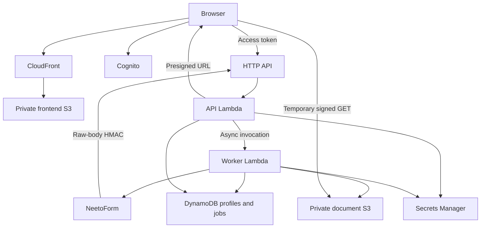

# Architecture and behavior

Two Lambdas keep network operations outside HTTP request time limits. The API verifies signatures before parsing webhook bodies and accepts valid work with HTTP 202. DynamoDB leases serialize writes for each profile and each sync job: overlapping webhooks and sync jobs cannot overwrite a fixed-key PDF concurrently. Workers have a 120-second timeout and leases last 130 seconds, so an expired invocation cannot keep writing after lease reassignment. Contention triggers native Lambda retries. Reserved concurrency is optional; the supplied AWS account has a total concurrency quota of ten and cannot reserve even one execution without a quota increase. Lambda native asynchronous delivery retries unhandled failures twice. There is no dead-letter destination in V1; inspect CloudWatch errors and use a full sync to reconcile failures. Webhook acceptance means queued, not yet stored.

Manual synchronization returns a job ID and checkpoints each processed submission. Jobs continue through native self-invocation in small batches; the UI polls status. A DynamoDB transaction prevents overlapping manual sync requests. A lease permits recovery after an abandoned job. An expired lease does not delete data. Large backlogs should be monitored; this design favors correctness and simplicity over high ingestion throughput. Sustained same-profile contention can exhaust native retries; reconcile through manual sync and monitor errors.

## Identity and documents

The profile UUID is UUIDv5 of form ID and external submission ID. It is an internal UUID, not an email or name; deterministic allocation prevents duplicate identities even on simultaneous first delivery. DynamoDB revision conditions protect writes. The document key is always `profiles/<profileId>/current/profile.pdf`, independent of untrusted filenames. Original sanitized display names are metadata.

Metadata is written before downloading a file. Missing/failed files record PARTIAL or FAILED status and preserve a previous document. Oversized or invalid documents are rejected. Repeated unchanged submissions check S3 metadata without downloading again; missing S3 objects are recovered. Source URL identity/version metadata determines whether a document changed, with the submission update timestamp used when the attachment has no explicit version; temporary signature query parameters are excluded. If Neeto replaces content at an identical URL without changing any version/identity metadata, the adapter needs an additional revision field or an explicit refresh enhancement. V1 cannot infer an invisible remote content change. Only the first uploaded document is handled, and only PDF is supported.

Out-of-order submissions with older source update timestamps are ignored. No automatic reconciliation deletes records or files. V1 has no profile-delete endpoint and no lifecycle deletion.

## Search and API

List reads traverse every DynamoDB Scan page, then filter case-insensitively across name, email, LinkedIn, theme, and support. Results are sorted and paginated in the application. `totalProfiles` counts all synchronized profiles, while `total` counts the filtered results. The UI uses `totalProfiles` for the top submission counter. Themes are derived from all profiles. This is intentionally a small-dataset design: each search remains O(N), and concurrent writes can make counts change between pages. Do not claim database-indexed search. Repository interfaces allow a future index without changing the UI.

`POST /sync` returns 202 with a job; `GET /sync/{jobId}` returns processed/created/updated/unchanged/failed counters and status. `GET /sync` restores status after refresh. Missing integration configuration returns a safe error. Document GET accepts `disposition=attachment` for attachment disposition; default is inline. URLs expire after 900 seconds and responses are not cached. Profile JSON omits object keys and private source URLs.

Future roles, document versions, and extraction belong in the existing service/repository interfaces; none are implemented. EventBridge may later invoke the worker's sync workflow, but no schedule is deployed. Automatic ingestion currently uses Neeto webhooks.
